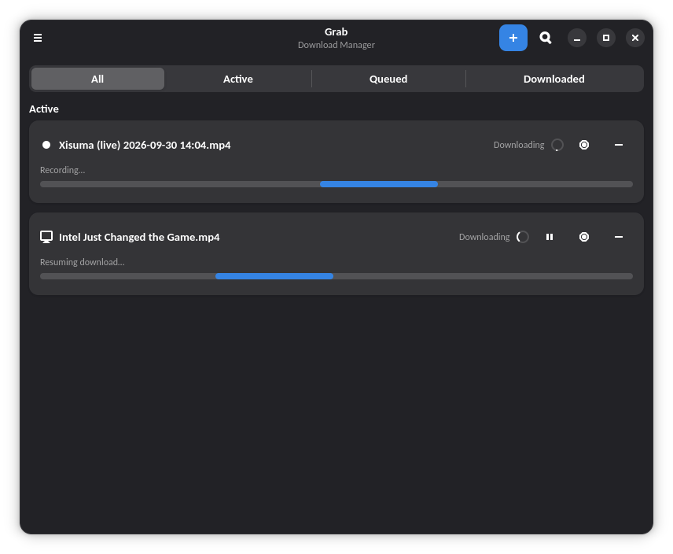
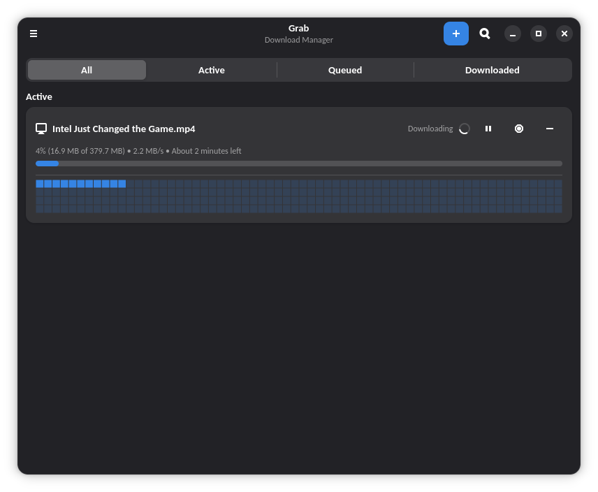
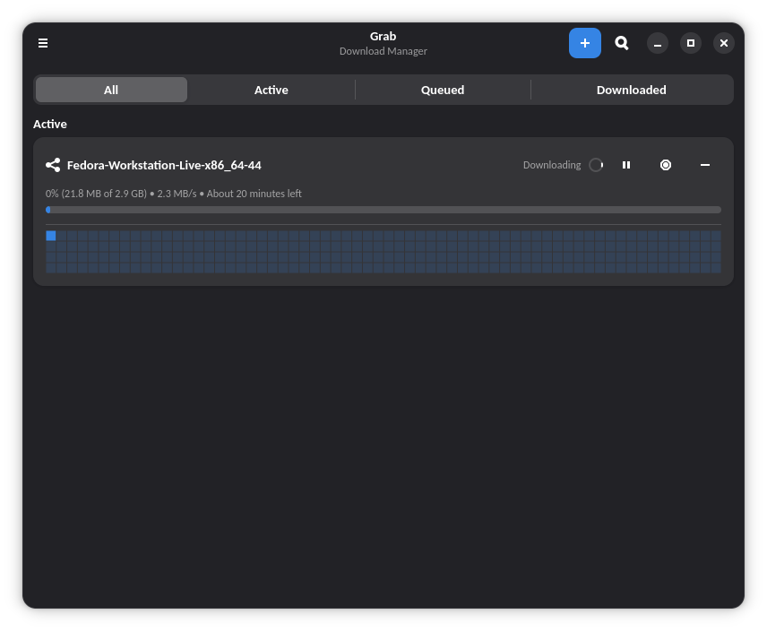
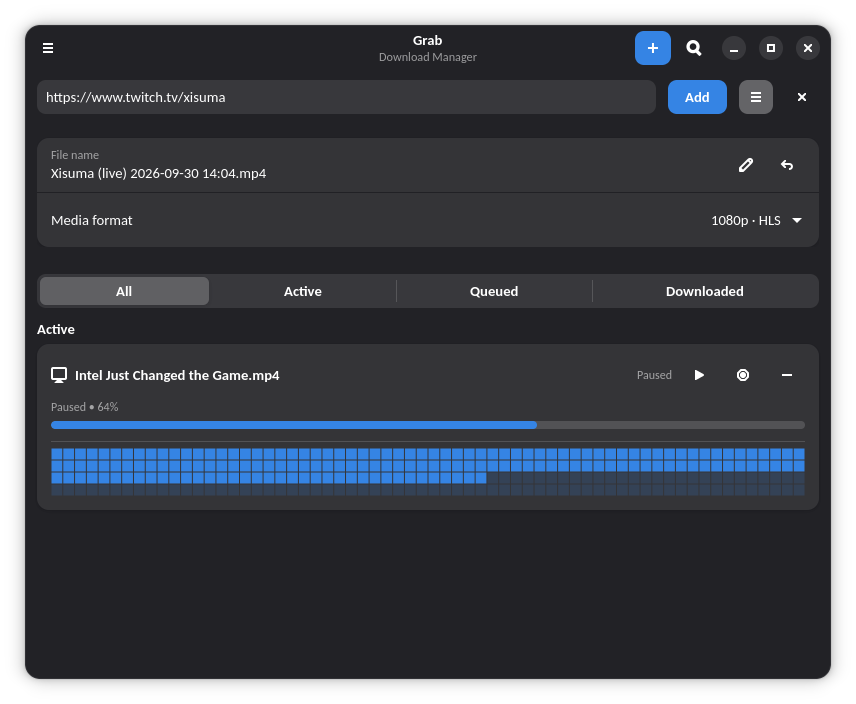
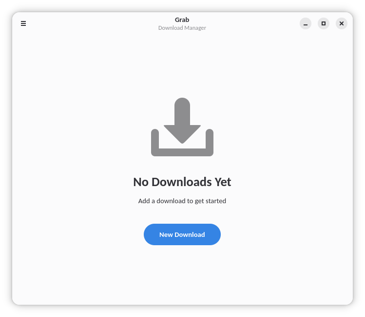

# Grab

A download manager for GNOME. Built with GTK 4 and libadwaita.

## Screenshots

<p align="center">
  
  <br>
  <em>Live stream recording alongside active downloads</em>
</p>

<p align="center">
  
  <br>
  <em>Active downloads with per-block progress maps</em>
</p>

<p align="center">
  
  <br>
  <em>Torrent download with segmented filter (All / Active / Queued / Downloaded)</em>
</p>

<p align="center">
  
  <br>
  <em>New Download card with inline media format picker</em>
</p>

<p align="center">
  <picture>
    <source media="(prefers-color-scheme: dark)" srcset="screenshots/dark-empty.png">
    
  </picture>
  <br>
  <em>Empty state</em>
</p>

<p align="center">
  
  <br>
  <em>Preferences: simultaneous downloads, connections, retries, speed limit</em>
</p>

<p align="center">
  
  <br>
  <em>Preferences: seeding, DHT, and peer limit</em>
</p>

## Install

From FlatPark (recommended, gets updates via `flatpak update`):

```bash
flatpak remote-add --if-not-exists flatpark https://dl.flatpark.org/flatpark.flatpakrepo
flatpak install flatpark io.github.linuxuser67.Grab
```

Or manually from the [latest release](https://github.com/Linuxuser67/Grab/releases):

```bash
flatpak install --user Grab.flatpak
```

### Cookies from Browser in the Flatpak

The sandbox ships without access to browser profiles. When you pick a browser
under Preferences → Authentication → Cookies from Browser and its profile is
unreachable, Grab shows the exact `flatpak override` command to grant
read-only access — or run the equivalent yourself:

```bash
flatpak override --user --filesystem=~/.config/<browser-dir>:ro io.github.linuxuser67.Grab
```

Undo with `flatpak override --user --reset io.github.linuxuser67.Grab`.

## Notes for packagers

Flatpak-only.

```bash
flatpak-builder --user --install build build-aux/io.github.linuxuser67.Grab.json
```

## License

Grab is free software: you can redistribute it and/or modify it under the
terms of the GNU General Public License as published by the Free Software
Foundation, version 3 only. See [LICENSE](LICENSE) for the full text.
